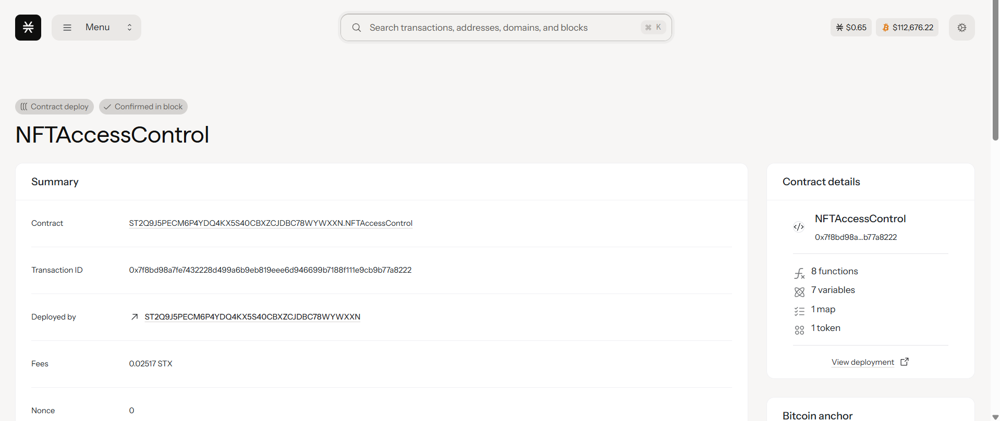

# NFT Access Control

## Project Description

This project implements a blockchain-based access control system using Non-Fungible Tokens (NFTs) on the Stacks blockchain. Each NFT represents a digital access pass that grants holders specific permissions to execute restricted contract functions. The system uses different access levels assigned to NFTs, allowing for granular permission management.

The core functionality includes:
- **Minting Access NFTs**: Contract owner can mint NFTs with specific access levels
- **Premium Content Access**: Users with appropriate NFT access levels can access restricted content/functions

## Project Vision

Our vision is to revolutionize digital access control by leveraging blockchain technology and NFTs to create a decentralized, transparent, and secure permission system. We aim to eliminate traditional centralized access control mechanisms by providing a trustless system where ownership of specific NFTs automatically grants access to corresponding digital resources and services.

This system empowers content creators, service providers, and organizations to implement sophisticated access control mechanisms without relying on traditional authentication systems, while providing users with true ownership of their access rights through tradeable NFT assets.

## Future Scope

### Phase 1 - Enhanced Access Control
- **Multi-tier Access Levels**: Implement hierarchical access levels (Basic, Premium, VIP, Admin)
- **Time-based Access**: NFTs with expiration dates for temporary access
- **Batch Operations**: Mint multiple NFTs in a single transaction

### Phase 2 - Advanced Features
- **Access Level Upgrades**: Allow users to upgrade their NFT access levels
- **Delegation System**: Enable NFT holders to temporarily delegate access to others
- **Access Analytics**: Track and monitor access patterns and usage statistics

### Phase 3 - Integration & Scalability
- **Cross-Contract Integration**: Enable access control across multiple smart contracts
- **Marketplace Integration**: Built-in marketplace for trading access NFTs
- **Oracle Integration**: Dynamic access control based on external data feeds

### Phase 4 - Enterprise Solutions
- **Role-based Access Control (RBAC)**: Complex organizational permission structures
- **Audit Trail System**: Comprehensive logging of all access events
- **Multi-signature Requirements**: Enhanced security for high-level access functions

## Contract Address Details
ST2Q9J5PECM6P4YDQ4KX5S40CBXZCJDBC78WYWXXN.NFTAccessControl

